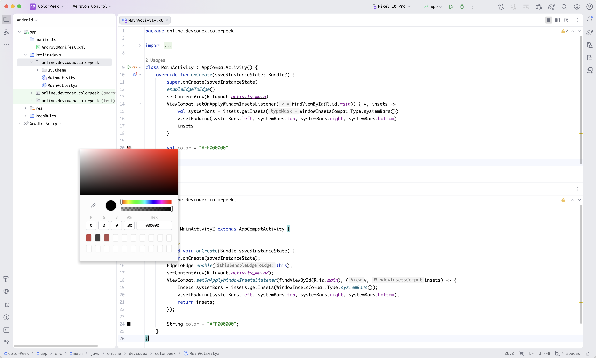

# ColorPeek

[](https://github.com/DevCodexStudio/ColorPeek/actions/workflows/build.yml)
[](LICENSE)

[Website](https://devcodexstudio.github.io/ColorPeek/) · [Releases](https://github.com/DevCodexStudio/ColorPeek/releases) · [Source](https://github.com/DevCodexStudio/ColorPeek)

ColorPeek provides Java and Kotlin code with the gutter color preview and editing experience familiar from Android Studio resource files.

Color values are shown as swatches beside the source line. Click a swatch to open the IDE color picker; ColorPeek writes the selected value back through PSI while preserving the original prefix, letter case, and compact/full representation where possible.

## Preview



## Features

- Gutter color previews for Java string literals and Kotlin literal string templates.
- Click-to-edit integration with the IDE color picker.
- PSI-based source updates performed inside a write action.
- Independent Java and Kotlin enable/disable controls.
- Opt-in previews for eight-digit hexadecimal numeric colors, with Compose Color avoidance enabled by default.
- Kotlin K1 and K2 support on compatible IDE versions.
- Extensible language-provider architecture for future language support.

## Supported color formats

| Prefix | Formats |
| --- | --- |
| `#` | `#RGB`, `#ARGB`, `#RRGGBB`, `#AARRGGBB` |
| `0x` / `0X` | `0xRGB`, `0xARGB`, `0xRRGGBB`, `0xAARRGGBB` |

When transparency is selected for an RGB value, ColorPeek promotes it to ARGB so the alpha channel is preserved. For example, `#9E2525` may become `#CC9E2525`.

## Settings

Open **Settings/Preferences → Tools → ColorPeek** to enable or disable ColorPeek independently for Java and Kotlin.

- **String colors:** enabled by default; supports the formats above.
- **Hexadecimal numeric colors:** disabled by default. Recognizes eight-digit `0xAARRGGBB` / `0XAARRGGBB` literals in Java and Kotlin, including `0xFFE2AA8A.toInt()`. Preserves prefix, case, digit separators, suffixes, and surrounding calls; alpha is always written first. Short numeric literals are not interpreted as shorthand colors.
- **Skip Compose Color calls:** enabled by default. Skips numeric arguments of calls resolved to `androidx.compose.ui.graphics.Color`, including import aliases, leaving the IDE's preview untouched. Disabling this may produce duplicate gutter icons. Resolution depends on project indexing and available dependencies; numeric previews are deferred during indexing when avoidance is enabled. Unresolved calls cannot be reliably identified as Compose.

Numeric literals can also represent masks or IDs. Enable numeric previews only when useful for your project.

When an alpha edit crosses Kotlin's inferred `Int`/`Long` boundary, ColorPeek adds `L` or `.toInt()` as needed to preserve the original integer type.

## TODO

- [ ] Smart numeric-color mode based on color-related contexts (for example, known APIs or annotations), to reduce previews for masks and IDs.
- [ ] Broader native-provider conflict detection beyond recognized Compose Color calls.
- [ ] Validate native Compose gutter coexistence across Android Studio / Compose Multiplatform versions and Kotlin K1/K2 modes.

## Compatibility

Releases contain two distributions with the same plugin ID. JetBrains Marketplace selects the correct one automatically:

- **Modern:** IntelliJ Platform `242+`, including Kotlin K1/K2 support.
- **Legacy:** IntelliJ Platform `232–241.*`.

## Language roadmap

- [x] Java
- [x] Kotlin
- [ ] Rust
- [ ] Python
- [ ] JavaScript / TypeScript
- [ ] Go
- [ ] C / C++
- [ ] C#
- [ ] More IntelliJ Platform languages requested by the community

## Development

```shell
./gradlew test legacy:test
./gradlew runIde
./gradlew buildReleaseArtifacts
```

New languages implement `LanguageColorProvider` and register against `online.devcodex.colorpeek.languageColorProvider`; the composite provider requires no changes.

See [CONTRIBUTING.md](CONTRIBUTING.md) for development guidance, [CHANGELOG.md](CHANGELOG.md) for release notes, and [MARKETPLACE.md](MARKETPLACE.md) for the publication checklist.
